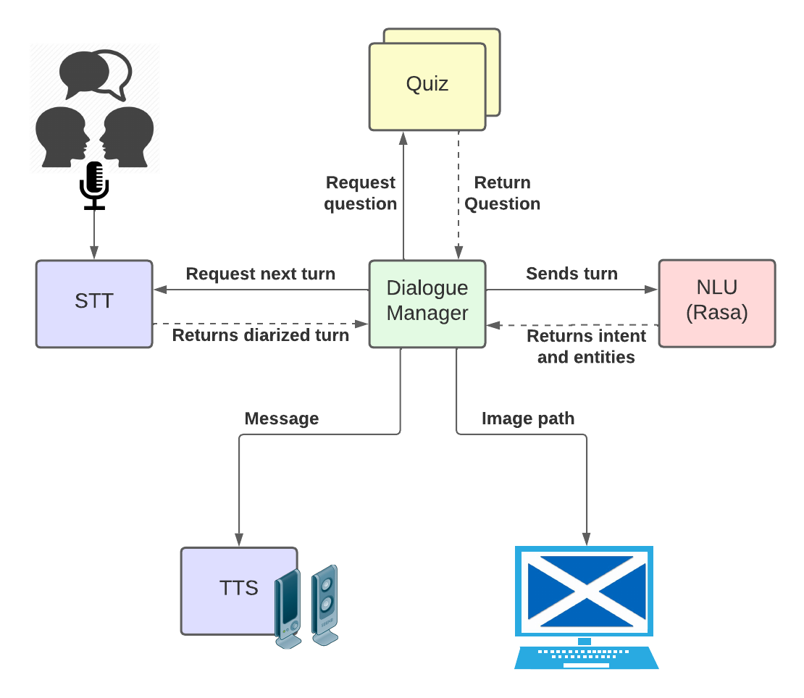

# Architecture Integration Concept
#### Author: Andy Edmondson
#### Updated: 13 Feb 2023
## Purpose

<p>
The system is made up of several modules, 
each of which will be worked on separately. 
The main system controller is the Dialogue Manager (DM) 
which must be able to communicate with the rest of the system 
in a way which preserves encapsulation and allows concurrency. 
In particular, it is important to ensure that the STT, TTS, NLU 
and GUI can capture, process and output without halting the DM.
</p>
<p>
To simplify this, a combination of Flask and the native Rasa HTTP API 
is used to connect modules. The exception is the Quiz module which, 
having no concurrency requirements is a simple Python class file imported 
directly into the DM.
</p>

| Module | Interface |
|--------| --- |
| STT    | Flask |
| TTS    | Flask |
| NLU | Rasa HTTP API |
| GUI | Flask |
| NLG | Integrated to DM |
| Quiz | Python module |




## Connections
### Flask REST API

<p>
The STT, TTS and GUI all use <a href="https://pypi.org/project/Flask/">Flask API</a> 
endpoints as shown below. The data format used is json so dicts are
used for data.</p>

| Module | Method | Endpoint | Host       | Port | Json                         |
|---| --- | --- |------------|---------|------------------------------|
| STT   | GET | /incoming_speech | 127.0.0.1  | 5001    | {'text': text, 'player': id} |
| TTS   | PUSH | /tts | 127.0.0.1  | 5004    | {'text': text}               |
| GUI   | PUSH | /update_flag | 127.0.0.1 | 5006    | {'filePath': image_path}     |

<p>
Success is always denoted by code 200, other codes can be defined 
to signal errors when fully defining the modules, refer to 
<a href="https://en.wikipedia.org/wiki/List_of_HTTP_status_codes">this list</a> when 
assigning new codes. 
</p>

### Rasa HTTP API
<p>
Rasa has its own HTTP API which can be started from the command line. 
It is started in the bash script controlling the servers 
(described below) in the following way:
</p>
```rasa run -i 127.0.0.1 -p 5005 -m models --enable-api &```
<p>
This starts the server on localhost:5005, using the latest model in 
the local "models" directory and with the HTTP api enabled. Since 
this project only uses the Rasa NLU module, it accesses 
the API using the following code.
</p>
```
intents = requests.post(url=f"http://{host}:{port}/model/parse",<br>
                        json={"text": text, "message_id": message_id})
```
<p>
This sends text to the NLU and receives a response containing the intents 
and entities identified by the model, along with their probabilities.
</p>
```
Sure, let's guess Malaysia.  - said by player 2
{
    'text': "Sure, let's guess Malaysia.", 
    'intent': 
    {
        'name': 'give_answer', 
        'confidence': 0.9895011782646179
    }, 
    'entities': 
    [
        {
            'entity': 'answer', 
            'start': 18, 
            'end': 26, 
            'confidence_entity': 0.9995859265327454, 
            'value': 'Malaysia', 
            'extractor': 'DIETClassifier'
        }
    ], 
    'text_tokens': [[0, 4], [6, 9], [10, 11], [12, 17], [18, 26]], 
    'intent_ranking': 
    [
        {'name': 'give_answer','confidence': 0.9895011782646179}, 
        {'name': 'greet','confidence': 0.010290027596056461}, 
        {'name': 'goodbye', 'confidence': 0.0001419934123987332}, 
        {'name': 'concur', 'confidence': 6.475452391896397e-05}, 
        {'name': 'contest', 'confidence': 1.9672743292176165e-06}
    ]
}
```


