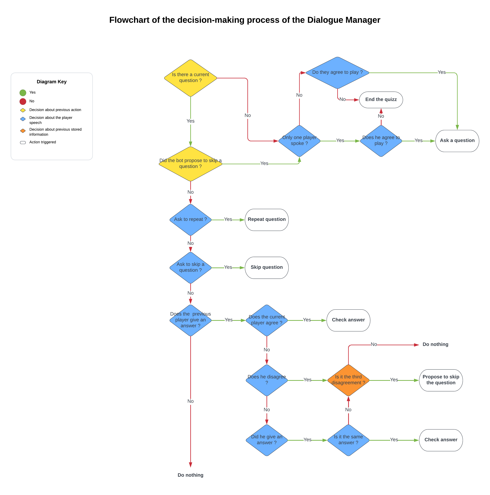

# Multi-Person-Quiz : Dialogue Manager

First version of the DM. 
Integrated with dummy modules for flask and rasa api integration.

## Important information
The database of the flags need to be in a folder data.
The relative path of the images is 'static/data/flagImg/' and the relative path of the csv file is 'static/data/codes_names.csv'.

This version uses the dummy modules as connections. Test data can be placed 
in the voice-flask.py file. 

This version uses rasa, so it can import an NLU model by placing it in the 
'./models' directory.

## Decision-making process

For the moment the decision-making process is as presented in the following flowchart.

## Test this version

To test this version of the DM, use ./script.bash to start the dummy module servers 
and rasa, and then run the MainDM.py file. To stop the severs, enter '3' in the 
script window. Before, you must have a NLU model in the folder 'models' (with at least the intents 'give_answer', 'concur', 'contest'). 

This should simulate a dialogue like this one:

-  Hey! Would you like to play a game ? You must associate each flag with its country.

P1 : yes, we can play ['concur', None, None]

- What is this flag ?
-  0 : The Philippines
-  1 : Gibraltar
-  2 : Isle of Man
-  3 : Saudi Arabia

P1 : I think it might be Mongolia ['give_answer', 'answer', 'Mongolia']

P2 : No way, that's definitely Zimbabwe ['contest', 'answer', 'Zimbabwe']

P1 : You always say Zimbabwe ['contest', 'answer', 'Zimbabwe']

P2 : I live in hope. ['greet', None, None]

P1 : Maybe it's Malaysia, shall we say Malaysia? ['concur', 'answer', 'Malaysia']

P2 : Sure, let's guess Malaysia. ['give_answer', 'answer', 'Malaysia']

P1 : Malaysia! ['give_answer', 'answer', 'Malaysia']
-  Unfortunately it's not the right answer. This is the flag of Isle of Man ! Would you like to try another flag ?

